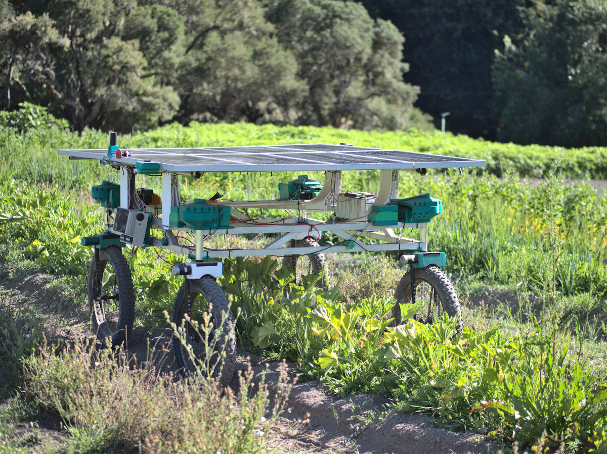

# Acorn precision farming rover

This is the software repository for Acorn, the precision farming rover
by Twisted Fields.

Code for this project is Apache 2.0 Licensed open source. Please see LICENSE
for details.

To learn more about Acorn, please see our [announcement blog post](https://community.twistedfields.com/t/introducing-acorn-a-precision-farming-rover-from-twisted-fields/).

## Running our code in simulation
If you are a software developer and would like to run our stack on your
computer, please see [the simulation readme](SIMULATION.md)
