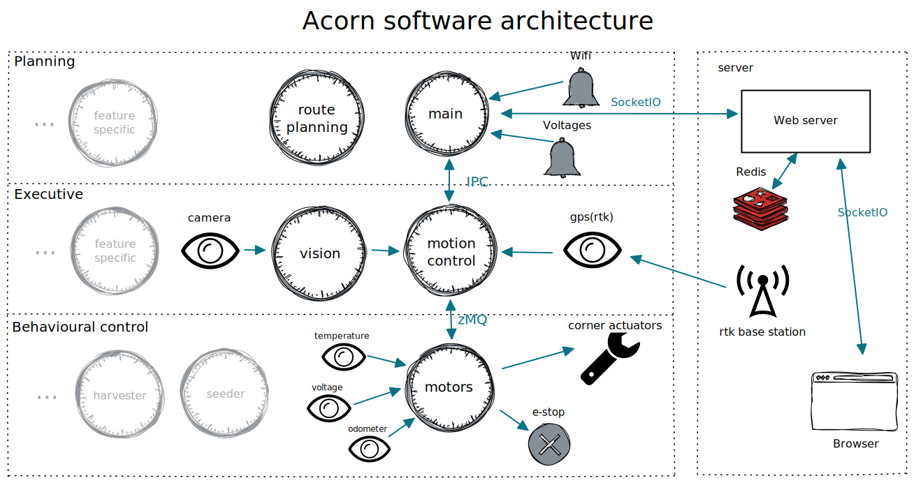

# Acorn precision farming rover

This is the software repository for Acorn, the precision farming rover by Twisted Fields.

Code for this project is Apache 2.0 Licensed open source. Please see [LICENSE](LICENSE) for details.

To learn more about Acorn, please see our [announcement blog post](https://community.twistedfields.com/t/introducing-acorn-a-precision-farming-rover-from-twisted-fields/).

## Running our code in simulation
If you are a software developer and would like to run our stack on your computer, please see [the simulation readme](SIMULATION.md).

## Software architecture
The codebase conceptually has three tiers each containing loops running at proper frequencies. IPC mechanisms even out the frequency discrepancies among loops. Perceptions and actuations happen near the loops require them, again with the frequency discrepancies evened out.

